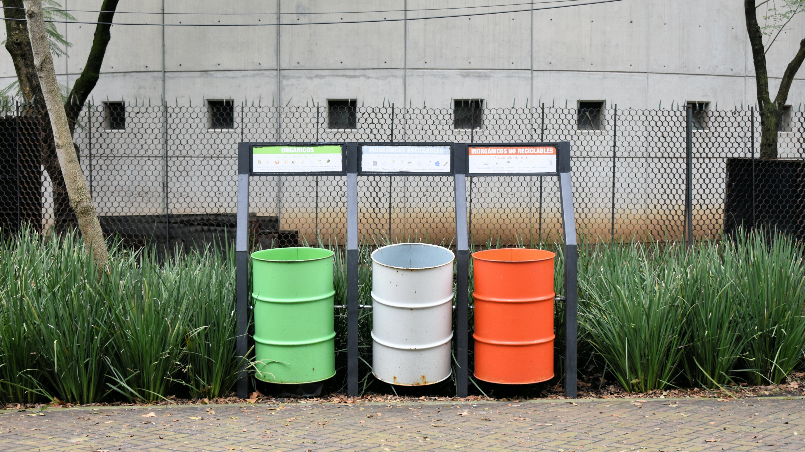
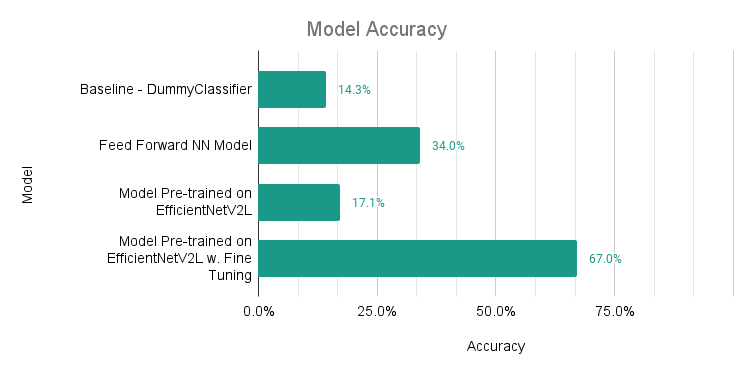
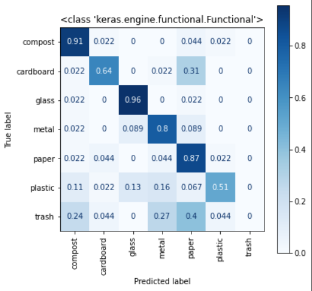

# Waste Classification  
#### By: Morgan Hofmann  

## Table of Contents
* [README.md](README.md) - Synopsis of this project
* [waste_classification.ipynb](waste_classification.ipynb) - All code associated with this project
* [Google Folder](https://drive.google.com/drive/folders/1FHqc94MjSna_A3b8D3PCY48LoA5o1ho1?usp=sharing) - Contains the [best models](https://drive.google.com/drive/folders/1GZ3NuZtd2IUv0MgFf3KSfgyO1XAp1n04?usp=sharing) saved in H5 format, [test images](https://drive.google.com/drive/folders/1VC9jnMe5MuDFkpMKfo96sNwZghNOhRdt?usp=sharing) and [train images](https://drive.google.com/drive/folders/1G6RS5oLGmDGA3Jk5Y1CV9g79gC3JbT6M?usp=sharing)  
* [visuals](visuals) - A folder comprised of images used in this document

## Installation Requirements  
* numpy  
* pandas  
* matplotlib  
* os  
* tensorflow  
* PIL  
* sklearn  
* Google Drive (if using Google Colab with images saved to Google Drive)  
  
## Executive Summary
According to the EPA (**1**), of the household waste that ended up in landfills in 2018, 24% of that material was food waste, 18% was plastic materials, and 12% was paper/paperboard. My goal with this project was to build a classification model that categorizes 7 types of waste using images in order to assist everyday consumers with sorting their waste.  
  
The bulk of my data came from [CompostNet](https://github.com/sarahmfrost/compostnet), and I acquired additional stock photos from [Unsplash](https://unsplash.com/) and used personal photos of waste to round out my dataset. The 7 classes that I categorized my images into were compost, cardboard, glass, metal, paper/paperboard, plastic, and trash. I made the assumption that composting, recycling, and trash services are available for everyday consumers, and assumed that waste sorting rules don't vary by location.

I was able to build a model that accurately classified the 7 types of waste with 67% accuracy on unseen data. The model was pre-trained on EfficientNetV2L and fine-tuned. The model classified glass with 96% accuracy, compost at 91% accuracy, and on the opposite end, it classified trash with 0% accuracy.

As for limitations in my process, the dataset I used was relatively small (2,210 images total) and should be expanded upon in further research. Furthermore, next steps should include supplementing the dataset with augmentation in preprocessing to increase the quantity of images for the train set. Personally, this was my first exploratory endeavor into computer vision - I learned a lot in the process and hope to write a Blog post on my many takeaways soon!

Lastly, my model isn't perfect. It misclassifies waste items 33% of the time, and always misclassifies trash. When items are misclassified and put in the wrong waste bin, contamination happens, and contaminated batches are typically landfilled even if part of the batch was originally sorted correctly.
  
## Data  
* [test images](https://drive.google.com/drive/folders/1VC9jnMe5MuDFkpMKfo96sNwZghNOhRdt?usp=sharing): 315 jpg images total, separated into the 7 classes - each class contains 45 jpg images
* [train images](https://drive.google.com/drive/folders/1G6RS5oLGmDGA3Jk5Y1CV9g79gC3JbT6M?usp=sharing): 1,895 jpg images total, separated into the 7 classes - each class contains 270 images, except compost contains 273 images, and trash contains 272
* Each image is 260 pixels wide and 195 pixels tall
* Each image shows the class item on a white background
  
## EDA, Cleaning & Munging  
* Collected and formatted data: used [Birme.net](Birme.net) to crop and scale images to 260 pixels wide and 195 pixels tall, used [PineTools.com](pinetools.com/add-noise-image) to add noise to the stock photos from Unsplash since the backgrounds of the stock photos were a purer white than other images
* Organized/labeled data by sorting images into the appropriate class
* Split data into Train and Test sets by randomly selecting data  
  
## Modeling
* I built the following fruitful models:

* My computer vision models are saved here: [best models](https://drive.google.com/drive/folders/1GZ3NuZtd2IUv0MgFf3KSfgyO1XAp1n04?usp=sharing)  

* The following is the confusion matrix for my best model, the model pre-trained on EfficientNetV2L with fine-tuning:  

## Sources
(**1**) [EPA National Overview: Facts and Figures on Materials, Wastes and Recycling](https://www.epa.gov/facts-and-figures-about-materials-waste-and-recycling/national-overview-facts-and-figures-materials)